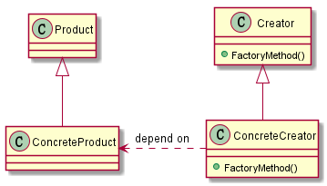
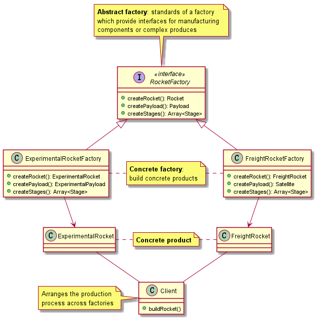
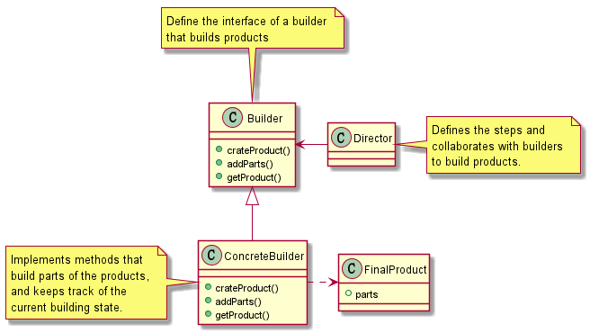

# TypeScriptDesignPattern

## Factory method
When a class cannot predict exactly what objects it will create or its subclasses may want to create more specified version of these object, then the Factory Method Pattern can be applied!

## Abstract Factory
This pattern defines the interfaces of a collection of factory methods, **without specifying concrete products**. This allows an entire factory to be replaceable, inorder to produce different products following the same production outline.

The intention of this pattern is providing a interface creating a serial of objects related or which are depend on each other without specify their spefic class. It is the solution to the problem of selecting the interface. 

When the products of system is more than one and system only consume one of them.

The details of the products are omitted from the diagram. These products belong to ExperimentalRocket and FreightRocket.

Abstract Factory Pattern makes the abstraction on top of different concrete factories. At the scope of a single factory or a single branch of factories, it just works like the Factory Method Pattern. However, the highlight of this pattern is to make a whole family of products interchangeable.

## builder 
While Factory Patterns expose the internal components , the Builder Pattern encapsulates them by exposing only the building steps and provides the final products directly. At the same time, the Builder Pattern also encapsulates the internal structures of a product. This makes it possible for a more flexible abstraction and implementation of building complex objects.

The Builder Pattern has a similar scope to the Abstract Factory Pattern, which extracts abstraction from a complete collection of operations that will finally initiate the products. Compared to the Abstract Factory Pattern, a builder in the Builder Pattern focuses more on the building steps and the association between those steps, while the Abstract Factory Pattern puts that part into the clients and makes its factory focus on producing components.

# Good TypeScript references
[TypeScript Document In Chinese](https://www.tslang.cn/docs/home.html)
[TypeScript Deep Dive](https://basarat.gitbooks.io/typescript/)
